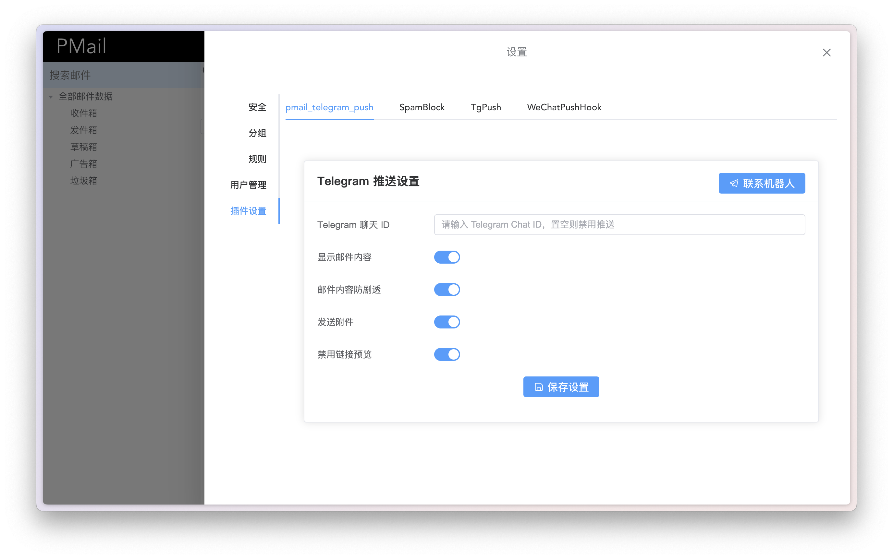

# Pmail Telegram 推送插件

这是一个 [Pmail](https://github.com/Jinnrry/PMail) 插件，用于将新收到的邮件实时推送到您的 Telegram 机器人。



## ✨ 功能

- **显示内容**：可选择是否在推送中包含邮件的文本内容。
- **剧透模式**：为保护隐私，可将邮件内容设置为默认隐藏（Spoiler）。
- **发送附件**：支持将邮件中的附件一并发送。
- **调试模式**：提供详细的日志输出，方便调试。
- **设置代理**：支持通过 HTTP 或 Socks5 代理发送请求。
- **多用户支持**：每个用户可以独立配置自己的 Telegram 聊天 ID。

## 🚀 安装

1.  **编译插件**：

    ```bash
    CGO_ENABLED=0 go build -o pmail_telegram_push
    ```

2.  **复制插件**：
    将编译好的 `pmail_telegram_push` 文件复制到 Pmail 的 `plugins` 目录下。

    ```bash
    cp -v ./pmail_telegram_push ./plugins/pmail_telegram_push
    ```

3.  **添加权限**：
    为插件添加可执行权限。

    ```bash
    chmod +x ./plugins/pmail_telegram_push
    ```


## ⚙️ 配置

在 Pmail 的 `config` 目录下，创建或编辑 `pmail_telegram_push.json` 文件，并填入以下配置：

```json
{
  "telegram_bot_token": "YOUR_TELEGRAM_BOT_TOKEN",
  "debug": false,
  "proxy": "",
  "timeout": 30
}
```

### 配置项说明

| 配置项               | 类型      | 是否必需 | 描述                                                                                        |
| -------------------- | --------- | -------- | ------------------------------------------------------------------------------------------- |
| `telegram_bot_token` | `string`  | 是       | Telegram 机器人 Token。可以从 [BotFather](https://t.me/BotFather) 获取。                    |
| `debug`              | `boolean` | 否       | 是否开启 Debug 模式，开启后会输出更详细的日志信息。默认为 `false`。                         |
| `proxy`              | `string`  | 否       | 代理服务器地址，格式为 `http://ip:port` 或 `socks5://ip:port`。默认为空字符串，不使用代理。 |
| `timeout`            | `string`  | 否       | 超时时间，格式为数字，单位为秒。默认为 `30`。                                               |

## 💡 使用

1.  **启动 Pmail**：
    管理员完成以上配置后，启动 Pmail 服务。

2.  **配置 Telegram 聊天**：
    用户前往网页完成配置。**需要在 Telegram 中与您的机器人进行一次交互**，以将聊天 ID 绑定到机器人。

3.  **接收邮件**：
    当有新邮件到达时，该插件会自动将其推送到您指定的 Telegram 聊天中。

## 🤝 贡献

欢迎提交 Pull Request 或 Issue，为项目做出贡献！

## 📄 许可证

本项目基于 [GPL-2.0](LICENSE) 许可证开源。
